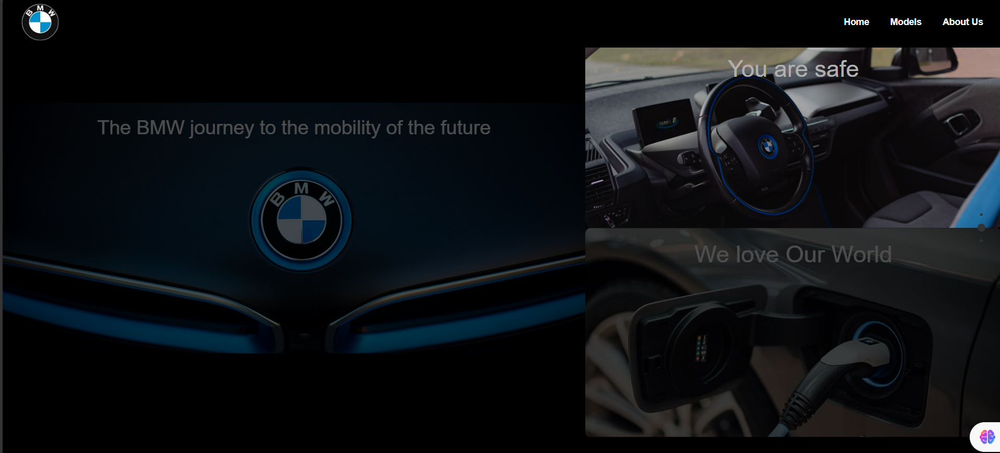

## Getting Started

### Prerequisites

What things you need to install the software and how to install them.

### Installing

A step-by-step guide that explains how to get a development environment running.

1. Clone the repository:
   ```sh
   git clone <repository-url>

2.   Open the cloned folder.

Open terminal and enter these commands:
```sh
npm install
npm run dev
```





